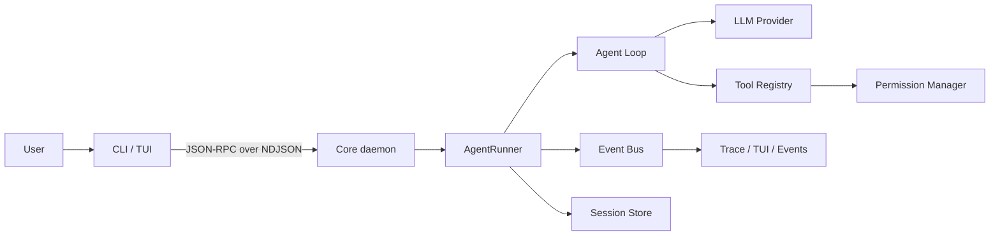

# ReliAgent

[](https://github.com/Jack-lyj/ReliAgent-Lab/actions/workflows/ci.yml)


> A reliable, observable and testable local Agent runtime.

ReliAgent 是一个面向代码仓库的本地 Agent 运行时，支持工具调用、事件流、
会话恢复、权限控制、MCP 扩展和终端交互。本项目重点研究 Agent 系统的
可靠性、安全边界、可观测性和自动化测试。

## 项目来源与贡献边界

本项目基于
[youngyangyang04/KamaClaude](https://github.com/youngyangyang04/KamaClaude)
进行二次工程化开发。

上游项目提供了 Agent Loop、CLI/TUI、daemon、会话、工具调用、上下文管理、
Skills、Subagents 和 MCP 等基础能力。

我主要完成了事件隔离、工作区路径安全、会话恢复、MCP 官方 SDK 迁移、
跨平台自动化测试、CI 质量门禁和异步故障诊断等改进。原作者信息及 LICENSE
均予以保留。
## 个人工程化改进

| 方向 | 问题 | 改进 | 验证 |
| --- | --- | --- | --- |
| 事件隔离 | 并发 run 可能串流或泄漏订阅 | 按 `run_id` 路由并支持幂等退订 | 并发及生命周期测试 |
| 路径安全 | 路径穿越和链接逃逸 | 统一真实路径解析与工作区边界校验 | POSIX symlink、Windows junction 测试 |
| 会话恢复 | daemon 重启后会话无法继续 | 扫描持久化状态并实现 `session.resume` | 恢复、损坏状态及重连测试 |
| MCP | 自定义传输兼容性有限 | 迁移官方 SDK，支持 stdio 和 Streamable HTTP | 协议与分页测试 |
| 故障诊断 | 后台写入异常可能造成退出死锁 | UTF-8 显式编码并传播后台任务异常 | TraceWriter 回归测试 |
| CI | 缺少跨平台质量门禁 | Linux/Windows 测试、Ruff、mypy、覆盖率门禁 | GitHub Actions |
## 系统架构



ReliAgent 采用客户端与核心进程分离的架构。CLI 和 TUI 通过基于 TCP NDJSON
的 JSON-RPC 协议连接常驻 Core daemon，Agent 的执行、工具调用、权限审批、
事件分发和会话持久化均由核心进程统一管理。

## 快速开始

### 环境要求

- Python 3.12
- [uv](https://docs.astral.sh/uv/)
- 可用的模型 API Key

### 1. 克隆项目

```bash
git clone https://github.com/Jack-lyj/ReliAgent-Lab.git
cd ReliAgent-Lab
```

### 2. 安装依赖

```bash
uv sync
```

### 3. 配置环境变量

将 `.env.example` 复制为 `.env`，然后在 `.env` 中配置模型 API Key。

Windows PowerShell：

```powershell
Copy-Item .env.example .env
```

Linux/macOS：

```bash
cp .env.example .env
```

请勿将包含真实密钥的 `.env` 文件提交到 Git 仓库。

### 4. 启动 ReliAgent

首先启动 Core daemon：

```bash
uv run kama-core
```

打开另一个终端，然后启动 TUI：

```bash
uv run kama-tui
```

也可以通过 CLI 执行任务：

```bash
uv run kama --help
```

## 测试与质量检查

测试分层、风险矩阵、跳过策略和 CI 准入标准见
[`docs/TEST_STRATEGY.md`](docs/TEST_STRATEGY.md)。

运行单元测试：

```bash
uv run pytest tests/unit -q
```

运行集成测试：

```bash
uv run pytest tests/integration -q
```

运行静态检查：

```bash
uv run ruff check .
uv run mypy src
```

Windows 本地验证基线：

- 单元测试：296 passed，3 skipped
- 集成测试：10 passed，1 skipped
- 总计：306 passed，4 skipped

其中，3 个符号链接用例在 Windows 上由 junction 回归测试替代；真实模型 E2E
用例在未配置 `ANTHROPIC_API_KEY` 时跳过。Linux 和 Windows 的完整质量检查由
GitHub Actions 自动执行。

## Roadmap

以下功能仍处于规划阶段，不代表当前已经实现：

- [ ] 根据代码变更生成风险驱动的测试计划
- [ ] 自动生成 pytest 边界值、异常流和参数化测试
- [ ] 根据 Git diff 分析影响范围并选择回归测试
- [ ] 结合覆盖率报告识别测试盲区
- [ ] 自动读取 CI 日志并分类失败原因
- [ ] 生成结构化测试报告与缺陷报告
- [ ] 支持测试用例失败后的自动定位与修复建议
- [ ] 构建 Planner、Generator、Executor、Reviewer 多 Agent 测试流水线

